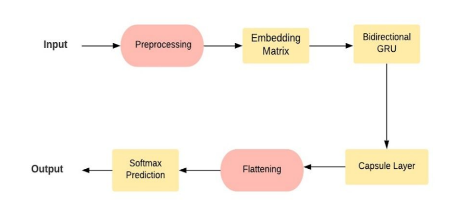
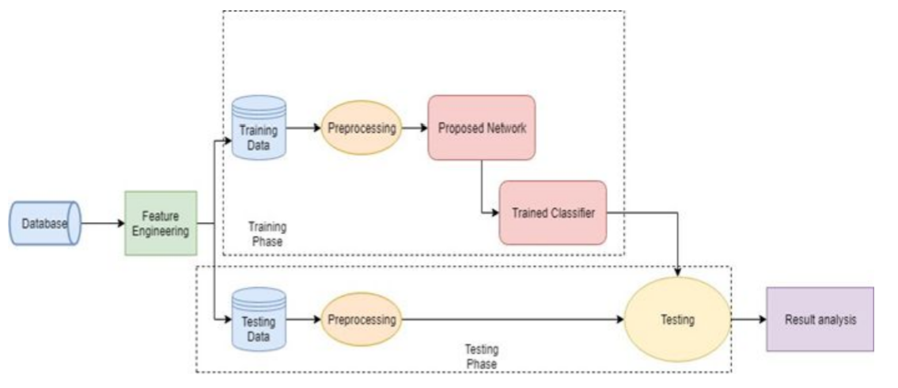
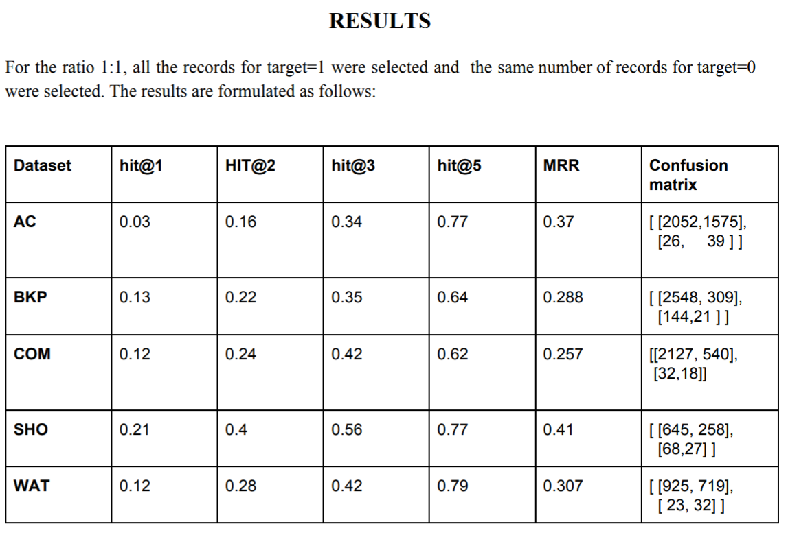

# Question Answering using Capsule Networks
 Capsule networks are considered to overcome the shortcomings of CNNs. They are used for understanding the spatial information, as they help in making sense of words even if they are not adjacent.A capsule consists of a group of neurons along with the activation, which helps in providing the probability for the existence of an entity in a piece of textual information.

## Packages and concepts used
* Python  
* Keras  
You can either run the code on python 3.6 or on the kaggle kernel GPU.

  
## Usage
Run the files in the following order:
1. **Libraries.py** contains all the libraries to be imported initially. 
2. **Dataset.py** consists of the importing the training and testing datasets. The dataset is incorporated from the Flipkart.com which is an e-commerce website. The dataset set contained 6 categories with questions and their specifications
3. **Preprocessing.py** has all the functions for preprocessing the dataset. The ‘question’ and ‘specification’ columns were merged together into a new column named ‘question_text’. For preprocessing the data, the spellings are corrected and special characters are removed.
4. **Embedding.py** contains word embeddings. For the embedding matrix, I used **glove embedding** and **fasttext embedding**. 
5. **Capsule.py** consists of the capsule layer where the activation function **squash** was used to bring the output vector in the range between 0 and 1. The parameters are set as follows:
 * Num_capsule = 10
 * Dim_capsule = 16
 * Routings = 3
 
## Architecture

## Methodology

## Results

## References
* **Investigating Capsule Networks with Dynamic Routing for Text Classification**  
  Authors: Zhao, Wei and Ye, Jianbo and Yang, Min and Lei, Zeyang and Zhang, Suofei and Zhao, Zhou  
  Journal: arXiv preprint arXiv:1804.00538  
  Year: 2018  
  Link : <https://arxiv.org/abs/1804.00538>
  
* **Dynamic Routing Between Capsules**  
  Authors: Sara Sabour, Nicholas Frosst, Geoffrey E Hinton  
  Journal : arXiv:1710.09829  
  Year: 2017  
  Link: <https://arxiv.org/abs/1804.00538>

